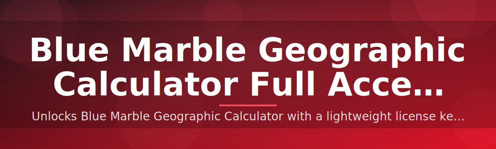

# 🌐 Blue Marble Geographic Calculator — Full Access Patch 🔑

### ⭐ Star this repo if it helped you!

  

## Table of Contents

- [About / Overview](#about--overview)
- [Requirements](#requirements)
- [Features](#features)
- [Installation](#installation)
- [FAQ](#faq)
- [Community / Support](#community--support)
- [License](#license)
- [Disclaimer](#disclaimer)
- [Download](#download)

## About / Overview

Blue Marble Geographic Calculator is a coordinate conversion and geodetic transformation tool used across GIS, surveying, and mapping workflows. Full licenses typically require ongoing subscription management, activation servers, and per-seat billing — friction that slows down teams who just need to run conversions locally.

This repository packages a standalone Windows executable that applies a license patch, unlocking the full feature set without the standard activation flow.

<strong>What problem does this solve?</strong>

Standard licensing for this class of geodetic software often ties access to online activation checks, seat limits, and renewal cycles. For users running one-off jobs, offline environments, or legacy projects, that overhead adds unnecessary steps between install and actual use.

The patched build removes the activation dependency so the application launches directly into its full-access state.

> [!NOTE]
> This tool is distributed as a single `.exe` file. There is no installer wizard, no source build, and no package manager involved.

<strong>How it works</strong>

The executable bundles the application binary together with a license patch layer applied at build time. On launch, the patched binary reports full-access status instead of triggering the standard license-check routine.

> [!TIP]
> Keep the downloaded `.zip` archive in case you need to reinstall or move to a new machine — re-downloading is not required for reuse.

## Requirements

- Windows 10 or Windows 11 (64-bit)
- Minimum 4 GB RAM
- ~200 MB free disk space
- Administrator rights for first launch

> [!IMPORTANT]
> No Python, pip, or additional runtime is required. This is a self-contained Windows executable — do not attempt to run it through a script interpreter or build it from source.

## Features

- Full coordinate transformation engine unlocked, no feature gating
- Batch geographic-to-projected coordinate conversions
- Support for a wide range of datum and projection definitions
- Offline operation — no activation server calls after setup
- Single-file `.exe` distribution, no dependency installation
- License patch applied automatically on first run
- Compatible with standard Blue Marble project and data file formats
- Regular update cadence tied to yearly release cycle

## Installation

<strong>Step-by-step setup</strong>

1. Download the `.zip` package using the download button below.
2. Extract the archive to a folder of your choice on your Windows machine.
3. Run the `.exe` file inside the extracted folder — right-click and select "Run as administrator" if prompted.
4. Launch the application; full access is applied automatically, no license key entry required.

> [!WARNING]
> Some antivirus tools flag license-patched executables as suspicious due to the patching technique itself, not malicious behavior. Verify the source before running any unfamiliar `.exe`, and use your own judgment regarding Windows Defender or SmartScreen prompts.

## FAQ

<strong>Common questions</strong>

**Does this require an internet connection?**
No. Once extracted and launched, the application does not need to contact an activation server.

**Will this work on Windows 11?**
Yes, the executable is built and tested for both Windows 10 and Windows 11 (64-bit).

**Do I need to install anything else?**
No. The `.exe` is self-contained — no Python, no pip, no additional runtimes.

> [!TIP]
> If the application fails to launch, confirm you extracted the full `.zip` contents rather than running the `.exe` directly from inside the archive viewer.

**Can I use this alongside an existing licensed install?**
Run it in a separate folder to avoid file conflicts with an existing installation.

## Community / Support

For questions, issues, or suggestions, please use the repository's Issues tab. Before opening a new issue, check existing threads — many setup questions are already answered there.

Contributions via pull requests are welcome for documentation improvements and compatibility notes.

## License

Released under the MIT License, 2026. See the `LICENSE` file in this repository for full terms.

## Disclaimer

> [!CAUTION]
> This project modifies standard licensing behavior of third-party software. It is provided for educational and archival purposes only. You are responsible for ensuring your use complies with the original software's license terms and your local laws. The repository owner and contributors assume no liability for misuse.

## Download

  

